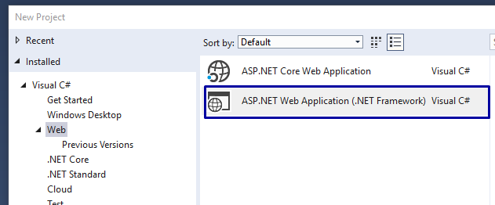
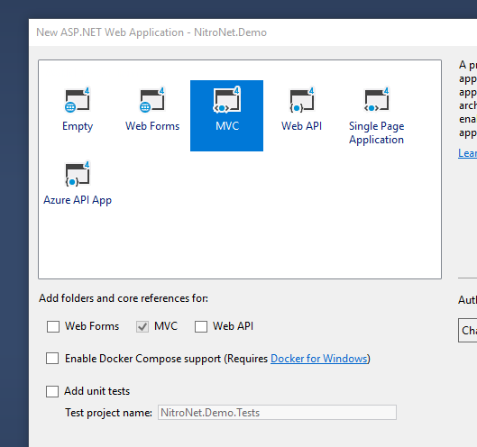

# NitroNet.Demo

## Description

Here you find a Nitronet Demo solution where you can see how [NitroNet](https://github.com/namics/NitroNet) has been integrated and configured on basis of a small **default Visual Studio ASP.NET MVC Web Application**.

This Demo solution can facilitate your first steps developing with NitroNet.

You can find even more infos and samples here:
- handlebars documentation: https://handlebarsjs.com/
- nitro documentation: https://github.com/namics/generator-nitro/blob/master/packages/project-nitro/project/docs/nitro.md
- NitroNet code samples: https://github.com/namics/NitroNet/blob/master/docs/samples.md

## How this Demo was created

**(1)** A clean Visual Studio solution has been created with a single ASP.NET Web MVC Application:

**(2)** Installation and configuration of NitroNet:
- https://github.com/namics/NitroNet/blob/master/docs/installation.md
- https://github.com/namics/NitroNet/blob/master/docs/configuration.md

In this demo the NuGet `NitroNet.UnityModules` was used.

**(3)**  The `HomeController` has been rewritten to use handlebars views and not the Razor (.cshtml) files.
Therefore the ViewModels are built in the `HomeController` and some handlebars files have been added to */frontend/patterns*

